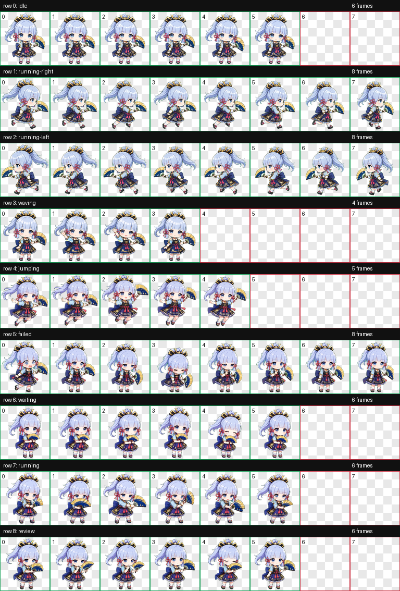

# Fanblade Chibi

Kamisato Ayaka (Genshin Impact) Codex pet package featuring a compact chibi character with fan-themed poses, clean transparent sprites, and ready-to-install Codex pet metadata.



## Highlights

- High-quality `1536 x 1872` WebP spritesheet built from `192 x 208` animation cells.
- Transparent-background pet art with no hidden RGB residue in transparent pixels.
- Codex-compatible `pet.json` included.
- Preview GIFs included for every animation state.
- Restored default Codex row behavior: `waving` is waving, and `jumping` is jumping.
- Preserves the later visual repairs: running-left cleanup, idle eye correction, and jump scale consistency.

## Preview

| Idle | Waving | Jumping |
| --- | --- | --- |
|  |  |  |

| Running Right | Running Left | Waiting |
| --- | --- | --- |
|  |  |  |

| Running | Review | Failed |
| --- | --- | --- |
|  |  |  |

## Install

From this repository folder, run:

```powershell
.\install-fanblade-chibi.ps1
```

The script copies the pet package into:

```text
%USERPROFILE%\.codex\pets\fanblade-chibi
```

After installing, restart Codex or reselect the pet so the app reloads the updated spritesheet.

## Animation Map

Codex pets use fixed animation rows. This package follows the standard row order:

| Row | State | Frames | Notes |
| --- | --- | ---: | --- |
| 0 | `idle` | 6 | Calm standing loop with subtle movement. |
| 1 | `running-right` | 8 | Right-facing drag/run motion. |
| 2 | `running-left` | 8 | Left-facing drag/run motion, repaired to avoid cut frames. |
| 3 | `waving` | 4 | Restored to waving after the temporary swap experiment. |
| 4 | `jumping` | 5 | Restored to jumping with consistent pet scale. |
| 5 | `failed` | 8 | Error/failure reaction. |
| 6 | `waiting` | 6 | Waiting-for-input pose. |
| 7 | `running` | 6 | Active work/thinking loop. |
| 8 | `review` | 6 | Review/focus loop. |

## Files

```text
outputs/fanblade-chibi/
  pet.json
  spritesheet.webp
  contact-sheet.png
  validation.json
  review.json
  previews/
    idle.gif
    running-right.gif
    running-left.gif
    waving.gif
    jumping.gif
    failed.gif
    waiting.gif
    running.gif
    review.gif
```

## Quality Checks

The included validation report confirms:

- Atlas format: WebP with alpha.
- Atlas size: `1536 x 1872`.
- Cell size: `192 x 208`.
- Used cells are non-empty.
- Unused cells are transparent.
- Transparent-pixel RGB residue count is `0`.
- Validation errors: `0`.

See:

- [`outputs/fanblade-chibi/validation.json`](outputs/fanblade-chibi/validation.json)
- [`outputs/fanblade-chibi/review.json`](outputs/fanblade-chibi/review.json)

## Public Repo Safety

This repository is intended to contain only the pet package and preview assets. Do not commit account recovery files, API keys, `.env` files, private keys, or local Codex configuration.

The `.gitignore` includes rules for common secret and local-only files, including GitHub recovery codes.

## License And Usage

This is a personal custom Codex pet asset package. Review the artwork and any source-reference rights before redistributing, remixing, or using it outside your own Codex setup.

